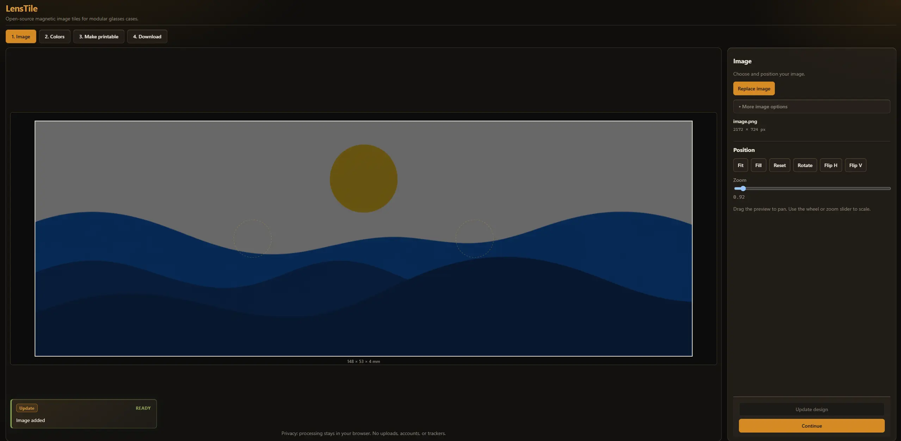
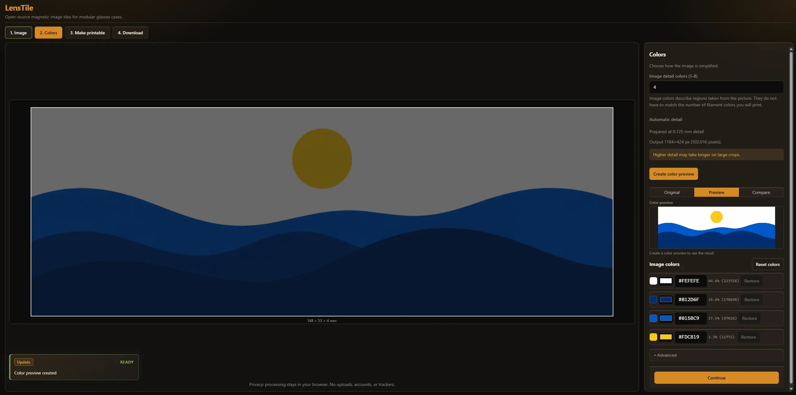
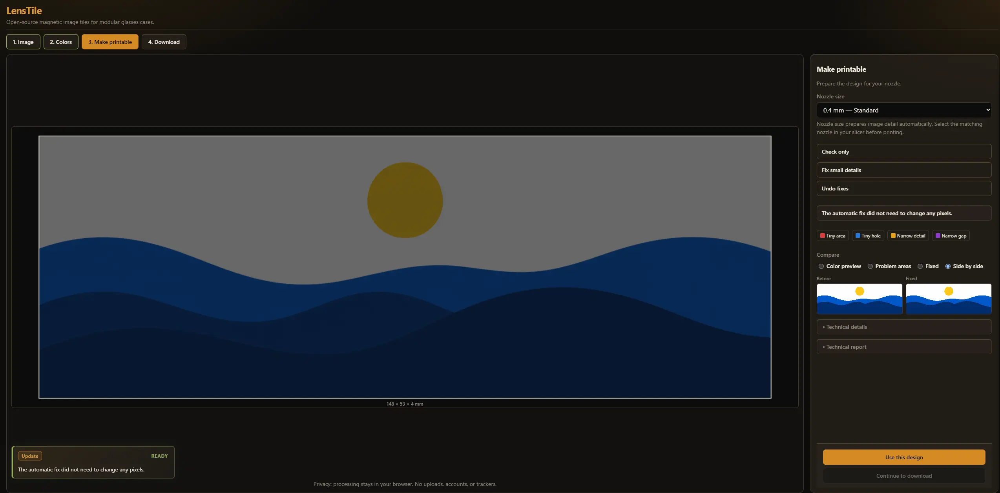
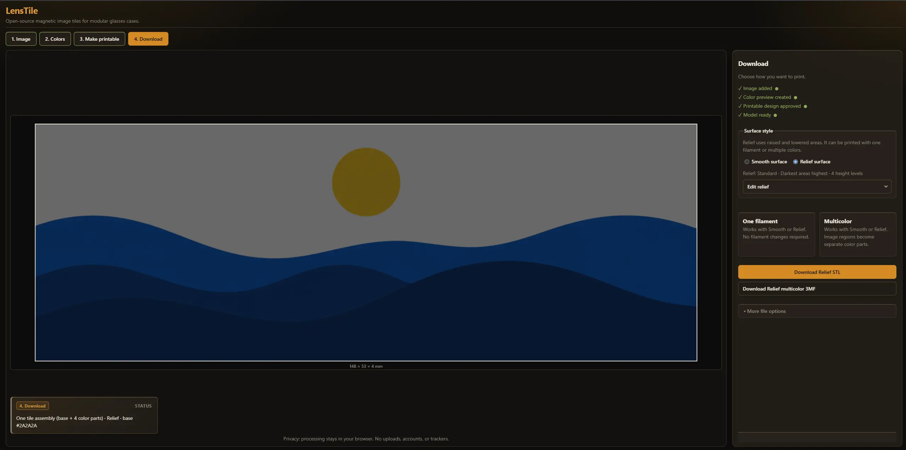
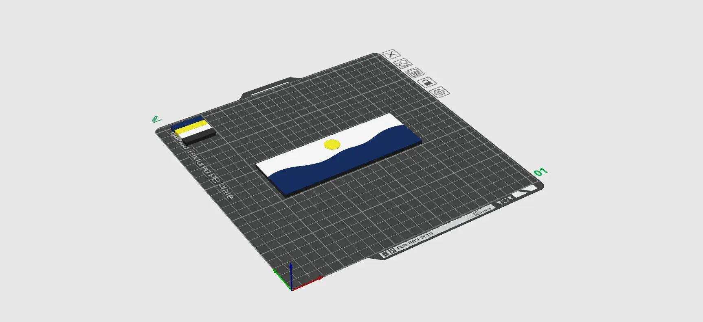

# LensTile

Open-source magnetic image tiles for modular glasses cases.

LensTile converts an image into a printable rectangular tile with magnetic
mounting recesses for compatible modular glasses cases. Everything runs locally
in your browser — images never leave your device.

## What it does

Import a photo, fit it to a 148 × 53 mm tile frame, reduce it to 1–8 print
colors, check printability, then download a Smooth or Relief model as a
one-filament STL or multicolor 3MF.

## Main features

- Local PNG / JPEG / WebP import (click or drag-and-drop)
- Crop, pan, zoom, rotate 90°, flip, Fit / Fill / Reset
- Deterministic 1–8 image-color processing (no randomness)
- Nozzle-aware preparation for 0.2 mm and 0.4 mm nozzles
- Printability analysis with conservative cleanup and explicit approval
- Smooth (flat) and Relief surfaces
- One-filament binary STL and multicolor 3MF
- Responsive desktop / tablet / mobile UI
- Zero runtime dependencies; no accounts, uploads, or analytics

## Screenshots

### 1. Image stage

<p align="center">
  
</p>

Import a photo and position it inside the 148 × 53 mm tile frame with pan,
zoom, rotate, flip, and Fit / Fill / Reset.

### 2. Colors stage

<p align="center">
  
</p>

Reduce the artwork to print colors, preview the result, and edit palette
swatches before printability review.

### 3. Make printable stage

<p align="center">
  
</p>

Choose a nozzle profile, review printability findings, and approve the cleaned
design before model generation.

### 4. Download stage

<p align="center">
  
</p>

After approval, pick Smooth or Relief and download a one-filament STL and/or
multicolor 3MF.

### 5. Slicer preview

<p align="center">
  
</p>

Open the exported multicolor 3MF in a slicer to inspect separate color regions
before printing.

## Privacy / local-first

All decoding, color reduction, cleanup, geometry, and packaging run in your
browser (including same-origin Web Workers). The application source does not
perform intended network requests. See `PRIVACY.md` and `SECURITY.md` for the
threat model, tested boundaries, and known limitations.

## Browser requirements

A current desktop or mobile browser with:

- ES modules
- Canvas
- Web Workers
- typed arrays / `Blob` / `URL.createObjectURL`

No Node.js, npm, or build step is required to run or develop LensTile.

## Quick start

From the repository root:

```bash
python3 -m http.server 8080
```

Windows:

```bash
python -m http.server 8080
```

Then open:

- App: http://localhost:8080/
- Tests: http://localhost:8080/tests/test-runner.html

## Usage workflow

### 1. Image

Choose or drop a PNG, JPEG, or WebP. Position the artwork inside the tile frame
with pan, zoom, rotate, and flip. Use Fit / Fill / Reset as needed. Replace or
remove the image from the Image panel.

### 2. Colors

Pick 1–8 image colors and create the color preview. Optionally edit palette
swatches, choose a transparency background, and compare Original / Preview.

### 3. Make printable

LensTile analyzes the design for tiny islands, holes, and narrow features. The
recommended path applies a conservative fix automatically, then waits for you to
**Use this design**. Changing the nozzle regenerates colors and printability in
place and requires review again before model build.

### 4. Download

After approval, the Download step builds the model once. Choose Smooth or Relief,
then download a one-filament STL and/or a multicolor 3MF (when two or more
artwork colors are used). Separate color STLs remain under More file options.

Default filenames:

- `lenstile-smooth.stl`
- `lenstile-relief.stl`
- `lenstile-multicolor.3mf`

## Smooth vs Relief

- **Smooth** — every used color ends at a flat Z = 4.0 mm top.
- **Relief** — image colors map to up to four top heights between 3.4 mm and
  4.0 mm (Subtle / Standard / Bold). Relief works with one filament or multicolor.

## One-filament STL vs multicolor 3MF

- **One-filament STL** — a single closed solid (Smooth or Relief).
- **Multicolor 3MF** — base + full-width structural bridge + used artwork colors as one
  multipart assembly with Materials-extension color groups. Standard RGB is
  design intent; slicers may still require manual filament assignment.

## Nozzle guidance

The website nozzle setting controls **image preparation** (processing grid and
printability thresholds):

| Nozzle | Role | Processing |
|--------|------|------------|
| 0.4 mm | Standard (default) | 8 px/mm |
| 0.2 mm | Fine detail | 10 px/mm |

Select the matching nozzle in your slicer. Layer height remains a slicer setting.

## Compatible glasses-case requirement

Tiles are sized for a compatible modular glasses case with matching magnet
layout. Confirm fit with your case before printing large batches.

```text
MakerWorld glasses-case link: to be added before release.
```

## Physical tile dimensions (Tile V1)

| Property | Value |
|----------|-------|
| Width | 148 mm |
| Height | 53 mm |
| Total thickness | 4.0 mm |
| Structural base | Z 0–2.5 mm |
| Structural bridge | Z 2.5–3.0 mm (full 148 × 53 mm, base color) |
| Artwork | Z 3.0–4.0 mm (or Relief top) |

## Magnet specifications

| Property | Value |
|----------|-------|
| Diameter | 8.5 mm |
| Depth | 2.5 mm |
| Centers | ±25 mm on the horizontal centerline |
| Structural bridge | Z 2.5–3.0 mm full-tile base-colored slab |
| Visible keepout halo | None |

See `hardware/TILE_V1_SPEC.md` for inspection notes and confidence.

## Printing guidance

- Prefer the nozzle that matches your preparation profile.
- Confirm dimensions 148 × 53 × 4 mm after import.
- For multicolor 3MF, map filaments manually if the slicer does not auto-assign.
- Check slicer repair warnings — LensTile blocks download on local validation
  failure but cannot read a slicer’s repair dialog.

## Known limitations

- Project save/load and offline service worker are not shipped yet.
- Printability thresholds are initial defaults pending physical print validation.
- Relief multi-height junctions may insert a tiny offset apex for manifold closure.
- Multicolor RGB intent may not match physically loaded filaments.
- Geometry is validated locally; slicer auto-repair UX still needs human confirmation.

## Browser support

Tested against modern Chromium-based browsers and current Firefox / Safari
feature sets that implement the APIs above. Older browsers without module workers
or Canvas will show a clear start-up error.

## Security / privacy notes

LensTile is local-first and is tested against documented threat cases (filenames,
image decoding bounds, worker message validation, XML escaping, ZIP paths, object
URL lifecycle, and prohibited network patterns). No audit can prove software is
vulnerability-free. See `SECURITY.md` for residual risks and responsible
disclosure.

## Development / testing

```bash
python3 -m http.server 8080
```

Open http://localhost:8080/tests/test-runner.html

The browser harness is authoritative. Automated export tests use an in-memory
download adapter and must never trigger real browser downloads or Save As
dialogs. Do not introduce Node.js, npm, or a package manifest.

## Repository structure

| Path | Purpose |
|------|---------|
| `index.html` / `src/` / `styles/` | Application |
| `hardware/` | Tile V1 spec + reference STL (do not modify `Body122.stl`) |
| `tests/` | Browser harness, fixtures, goldens |
| `docs/` | Architecture, risks, test strategy, conventions |
| `AGENTS.md` | Rules for coding agents |

## Contributing

See `CONTRIBUTING.md`. Keep milestones small, preserve determinism, and do not
add runtime dependencies or network access.

## Responsible disclosure

Report security issues privately when public disclosure would put users at risk.
Details are in `SECURITY.md`.

## License

MIT — see `LICENSE`.

## Asset licensing / provenance

- Application source and procedural fixtures: MIT (this repository).
- `hardware/Body122.stl`: reference mesh for Tile V1 inspection; do not modify.
- Tracked STL / 3MF under `tests/` are regression and packaging fixtures.
- Sample / icon asset folders are reserved; add only properly licensed files.
- README screenshots under `docs/images/` are maintainer-authored documentation
  assets covered by this repository’s license.

## Roadmap

See `ROADMAP.md`. Core export and workflow milestones through 7.4.1 / 8.2.1 are
complete. Offline persistence and public release follow-up items remain.

## Project status

LensTile is an open-source, local-first tool approaching public-repository
readiness. Physical print validation and the MakerWorld case link are still
outstanding before a formal 1.0 release claim.
